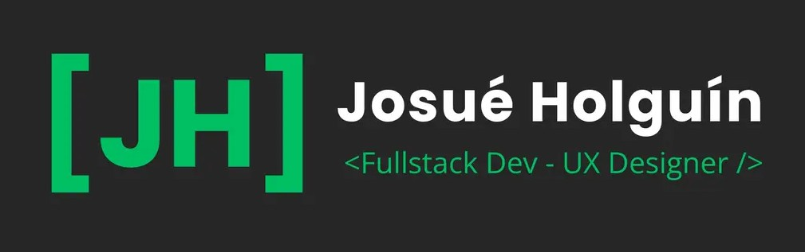

<div align="center">
  
</div>

# Hi there, I'm Josué Holguín 👋

<div align="center">
  
</div>

```typescript
const me = {
  name: "Josué Holguín",
  role: "Full Stack Developer",
  passion: ["Modern Web", "UX/UI Design", "Clean Code"],
  tools: ["React", "Laravel", "PostgreSQL", "Docker"],
  goal: "Building meaningful, efficient, and well-designed digital products.",
};
```

---

### 🚀 About Me

💻 **Fullstack Developer** with a strong focus on frontend and UX.
🎨 Passionate about building **clean, intuitive interfaces** that provide a smooth user experience.
⚙️ Constantly exploring **automation**, web performance, and scalable architectures.

---

### 🛠 Tech Stack & Tools

| Category        | Technologies                                                                                                                                                                                                                                                                                                                                                                                                                                                                                                                                                                                        |
| :-------------- | :-------------------------------------------------------------------------------------------------------------------------------------------------------------------------------------------------------------------------------------------------------------------------------------------------------------------------------------------------------------------------------------------------------------------------------------------------------------------------------------------------------------------------------------------------------------------------------------------------- |
| **Frontend**    |      |
| **Backend**     |                                                                                                                                         |
| **Tools & CMS** |                                      |

---

### 📊 GitHub Stats

<p align="center">
  
  
</p>

---

### 📫 Connect with me

<p align="left">
  <a href="https://www.linkedin.com/in/josue-holguin-4b5362221" target="blank">
    
  </a>
  <a href="https://github.com/JosueAHM" target="blank">
    
  </a>
  <a href="mailto:josue_holguin@outlook.com">
    
  </a>
</p>

---

<p align="center">
  ✨ <i>Always focused on building meaningful, efficient and well-designed digital products.</i>
</p>
